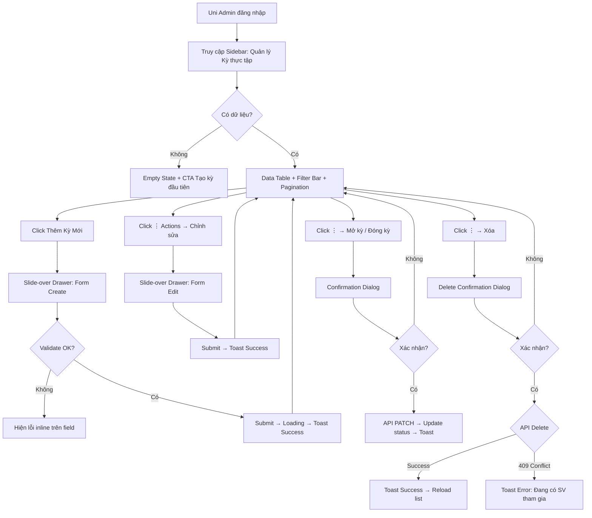

# Issue 60 — Term Management: UI/UX Design Document

> **Stitch Project:** `IOCv2 - Issue60 Term Management UI`
> **Project ID:** `10769867219988914236`
> **Design System:** Light Mode | Be Vietnam Pro | ROUND_FULL | Primary #d52020

---

## BƯỚC 1 — Phân tích Issue

### User Goal + Business Objective

| Dimension | Detail |
|---|---|
| **User Goal** | Uni Admin cần công cụ thiết lập, quản lý và theo dõi danh sách các Kỳ thực tập (Term) — bao gồm thêm, sửa, xóa, chuyển trạng thái |
| **Business Objective** | Term là **Container** cốt lõi ràng buộc sinh viên, điểm số và tính hợp lệ về thời gian thực tập cho toàn hệ thống. Nếu thiếu, dữ liệu rải rác không thống kê được |
| **Primary Actor** | Uni Admin (Quản trị viên trường đại học) |
| **Secondary Actor** | Không có |

### Functional Requirements

| # | Requirement | Mapping API |
|---|---|---|
| FR-01 | Xem danh sách Term dạng Data Table + Pagination | `GET /api/terms` |
| FR-02 | Tìm kiếm theo tên + Lọc theo trạng thái (Draft/Open/Closed) | Query params: `searchTerm`, `status` |
| FR-03 | Tạo mới Term (name, startDate, endDate, status) | `POST /api/terms` |
| FR-04 | Chỉnh sửa thông tin Term (name, startDate, endDate) | `PUT /api/terms/{termId}` |
| FR-05 | Chuyển trạng thái (Draft→Open, Open→Closed) | `PATCH /api/terms/{termId}/status` |
| FR-06 | Xóa cứng Term (chỉ khi chưa có dữ liệu ràng buộc) | `DELETE /api/terms/{termId}` |

### Edge Cases + Validation Rules

| Rule | Behavior |
|---|---|
| `end_date` ≤ `start_date` | API trả `400 Bad Request`. UI hiện viền đỏ + helper text |
| `name` rỗng | API trả `400`. UI hiện helper text "Tên không được để trống" |
| `name` > 100 ký tự | API trả `400`. UI limit maxLength |
| Xóa Term đang có sinh viên/group | API trả `409 Conflict`. UI hiện Toast lỗi đỏ |
| Admin Trường A sửa/xóa Term Trường B | API trả `403 Forbidden` (IDOR protection) |
| Term đã Closed | Không cho edit name/date. Chỉ xem |

---

## BƯỚC 2 — Thiết kế UX Flow

### User Flow Step-by-step



### Danh sách màn hình cần có

| # | Màn hình | Device | Screen ID (Stitch) |
|---|---|---|---|
| 1 | **Term Management - Data Grid** (Main List) | Desktop | `3f7b6669fd3a48aa99bc6367d59e54c1` |
| 2 | **Create New Term** (Slide-over Drawer) | Desktop | `a5c8dcd8301945cea6b3cb6e63c1530e` |
| 3 | **Edit Term** (Slide-over Drawer + Success Toast) | Desktop | `7ec83feced414508a59934b4b4e75b16` |
| 4 | **Confirmation Dialogs** (Delete + Change Status) | Desktop | `c2fdef793b1149ff8bbfa965353692c4` |
| 5 | **UI States Reference** (Loading/Empty/Error/Validation) | Desktop | `283f2e551f4a4df9b551c085216db38c` |
| 6 | **Mobile Responsive** (Card Layout + FAB) | Mobile | `204501da5dbf4b129b3a326c9b4ccfe4` |

### Trạng thái đặc biệt

| State | Behavior |
|---|---|
| **Loading** | Skeleton loader (5 hàng shimmer bars thay thế nội dung bảng) |
| **Empty** | Illustration + Title "Chưa có kỳ thực tập nào" + CTA button |
| **Error (Toast)** | Toast notification góc trên phải, nền đỏ, tự ẩn sau 5s |
| **Success (Toast)** | Toast notification góc trên phải, nền xanh, tự ẩn sau 3s |
| **Form Validation Error** | Field viền đỏ `#dc2626` + helper text bên dưới |

---

## BƯỚC 3 — Thiết kế UI trong Stitch

### Design Tokens Áp dụng

| Token | Value | Sử dụng |
|---|---|---|
| **Font Family** | Be Vietnam Pro (Google Font) | Toàn bộ UI |
| **Primary Color** | `#d52020` | CTA buttons, active nav, focus rings, FAB |
| **Roundness** | `ROUND_FULL` (border-radius: 9999px) | Buttons, inputs, badges, chips |
| **Color Mode** | LIGHT | Background trắng, text đen |
| **Spacing Scale** | 4px → 8px → 12px → 16px → 24px → 32px | Padding, margin, gap |

### Typography Scale

| Element | Size | Weight | Color |
|---|---|---|---|
| Page Title (H3) | 24px | Bold (700) | `text-gray-900` |
| Drawer Title (H4) | 20px | Bold (700) | `text-gray-900` |
| Table Header | 12px | Medium (500), Uppercase | `text-gray-500` |
| Body Text | 14px | Regular (400) | `text-gray-700` |
| Caption / Helper | 12px | Regular (400) | `text-gray-400` |
| Error Text | 12px | Medium (500) | `#dc2626` |

### Color Semantic

| Token | Hex | Usage |
|---|---|---|
| `--color-primary` | `#d52020` | Primary CTA, active state, focus ring |
| `--color-primary-light` | `#fee2e2` | Active nav background, hover subtle |
| `--color-success` | Green-700 / Green-50 | StatusBadge "Open", Success toast |
| `--color-warning` | Blue (info icon) | Status change confirmation |
| `--color-danger` | `#dc2626` | Delete button text, error borders, error toast |
| `--color-neutral` | Gray-600 / Gray-100 | StatusBadge "Draft" |
| `--color-closed` | Red-700 / Red-50 | StatusBadge "Closed" |

### Component Inventory

| Component | Status | Props |
|---|---|---|
| `SidebarMenu` | ✅ Existing | `activeItem: string` |
| `PageHeader` | ✅ Existing | `title, breadcrumbs, actions` |
| `SearchInput` | ✅ Existing | `placeholder, onChange, pill-shaped` |
| `SelectDropdown` | ✅ Existing | `options[], value, onChange, pill-shaped` |
| `DataTable` | ✅ Existing | `columns[], data[], onSort` |
| `PaginationBar` | ✅ Existing | `pageIndex, pageSize, totalCount` |
| `Button` | ✅ Existing | `variant: primary/outline/danger, pill, icon, disabled` |
| `Toast` | ✅ Existing | `type: success/error, message, duration` |
| `SlideoverDrawer` | ✅ Existing | `isOpen, onClose, title, subtitle` |
| `ConfirmDialog` | ✅ Existing | `title, description, icon, confirmLabel, onConfirm` |
| **`StatusBadge`** | 🆕 New | `status: 'Draft' \| 'Open' \| 'Closed'` |
| **`ActionDropdown`** | 🆕 New | `items: { label, icon, onClick, variant? }[]` |
| **`DatePickerInput`** | 🆕 New | `value, onChange, placeholder, error?` |
| **`SkeletonRow`** | 🆕 New | `columns: number` |

#### StatusBadge Component Spec

```
StatusBadge({ status })

Variants:
├── Draft  → bg: gray-100,  text: gray-600,  dot: gray-400
├── Open   → bg: green-50,  text: green-700, dot: green-500
└── Closed → bg: red-50,    text: red-700,   dot: red-500

Shape: pill (border-radius: 9999px)
Padding: px-3 py-1
Font: 12px, Medium (500)
Includes: colored dot indicator (6px circle) + label text
```

#### ActionDropdown Component Spec

```
ActionDropdown({ items })

Trigger: Vertical ellipsis icon button (⋮)
Dropdown: rounded-xl, shadow-lg, bg-white, border gray-100
Items:
├── { label: "Chỉnh sửa", icon: PencilIcon }
├── { label: "Mở kỳ" | "Đóng kỳ", icon: ToggleIcon }
├── Divider
└── { label: "Xóa", icon: TrashIcon, variant: "danger" → text #d52020 }

Min-width: 180px
Item padding: px-4 py-2.5
Hover: bg-gray-50
```

---

## BƯỚC 4 — Output

### 1. Danh sách màn hình

| # | Screen | Description |
|---|---|---|
| S1 | Term Management List | Màn hình chính với Data Table, Search, Filter, Pagination |
| S2 | Create Term Drawer | Slide-over panel form tạo mới Term |
| S3 | Edit Term Drawer | Slide-over panel form chỉnh sửa + Success Toast |
| S4 | Confirmation Dialogs | Delete Confirmation + Status Change Confirmation |
| S5 | UI States Reference | Loading skeleton, Empty state, Validation errors, Error toast + Action dropdown |
| S6 | Mobile View | Card-based layout, FAB, filter chips |

### 2. Layout Structure

```
┌─────────────────────────────────────────────────────────┐
│                    BROWSER VIEWPORT                      │
├──────────┬──────────────────────────────────────────────┤
│          │  Breadcrumb: Home / Quản lý / Kỳ thực tập   │
│          ├──────────────────────────────────────────────┤
│          │  [H3] Danh sách Kỳ thực tập    [+ Thêm Mới] │
│  SIDEBAR │──────────────────────────────────────────────│
│  (240px) │  [🔍 Search Input]  [▼ Trạng thái]          │
│          ├──────────────────────────────────────────────┤
│  Nav     │  ┌──────────────────────────────────────┐    │
│  Items   │  │  Tên Kỳ  │ Bắt đầu │ Kết thúc │ TT │⋮│  │
│          │  ├──────────────────────────────────────┤    │
│          │  │  Row 1    │ dd/mm   │  dd/mm   │ 🟢 │⋮│  │
│          │  │  Row 2    │ dd/mm   │  dd/mm   │ ⚪ │⋮│  │
│  --------│  │  Row 3    │ dd/mm   │  dd/mm   │ 🔴 │⋮│  │
│  Avatar  │  │  ...      │         │          │    │ │  │
│  + Role  │  └──────────────────────────────────────┘    │
│          │              Hiển thị 1-5 / 12   [< 1 2 3 >] │
└──────────┴──────────────────────────────────────────────┘
```

### 3. Component Tree cho từng màn hình

#### S1: Term Management List

```
PageLayout
├── SidebarMenu (activeItem: "terms")
│   ├── Logo
│   ├── NavItem: Dashboard
│   ├── NavItem: Quản lý Kỳ thực tập ← ACTIVE (bg: #fee2e2, text: #d52020)
│   ├── NavItem: Quản lý Sinh viên
│   ├── NavItem: Báo cáo
│   ├── NavItem: Cài đặt
│   └── UserCard (avatar, name, role badge)
└── ContentLayout (bg: gray-50/white)
    ├── Breadcrumb (items: ["Trang chủ", "Quản lý", "Kỳ thực tập"])
    ├── PageHeader
    │   ├── TitleGroup
    │   │   └── H3: "Danh sách Kỳ thực tập"
    │   └── Button (variant="primary", pill, icon="Plus", label="Thêm Kỳ Mới")
    ├── FilterToolbar (flex row, gap-3)
    │   ├── SearchInput (placeholder="Tìm tên kỳ thực tập...", pill, icon="Search")
    │   └── SelectDropdown (label="Tất cả trạng thái", options=["Draft","Open","Closed"])
    └── DataTableCard (bg-white, rounded-xl, shadow-sm)
        ├── TableHead (bg-gray-50)
        │   ├── TH: "Tên Kỳ" (sortable)
        │   ├── TH: "Ngày bắt đầu" (sortable)
        │   ├── TH: "Ngày kết thúc"
        │   ├── TH: "Trạng thái"
        │   └── TH: "Thao tác" (w-16)
        ├── TableBody
        │   └── TableRow[] (hover: bg-gray-50)
        │       ├── TD: Text (font-medium)
        │       ├── TD: Date (text-gray-500)
        │       ├── TD: Date (text-gray-500)
        │       ├── TD: StatusBadge (status prop)
        │       └── TD: ActionDropdown
        └── PaginationBar
            ├── Text: "Hiển thị 1-5 của 12 kỳ thực tập"
            └── PageControls (Previous, Numbers, Next)
```

#### S2: Create Term Drawer

```
SlideoverDrawer (isOpen, onClose, width=480px)
├── DrawerHeader
│   ├── CloseButton (icon="X", top-right)
│   ├── Title: "Thêm Kỳ thực tập mới"
│   └── Subtitle: "Điền thông tin để tạo kỳ thực tập mới"
├── DrawerBody (padding=24px, gap=20px)
│   ├── FormField
│   │   ├── Label: "Tên kỳ thực tập" + RequiredMark(*)
│   │   ├── TextInput (placeholder, maxLength=100, pill)
│   │   └── ErrorText? (conditional)
│   ├── FormField
│   │   ├── Label: "Ngày bắt đầu" + RequiredMark(*)
│   │   ├── DatePickerInput (placeholder="dd/mm/yyyy", icon="Calendar")
│   │   └── ErrorText? (conditional)
│   ├── FormField
│   │   ├── Label: "Ngày kết thúc" + RequiredMark(*)
│   │   ├── DatePickerInput (placeholder="dd/mm/yyyy", icon="Calendar")
│   │   └── ErrorText? (conditional)
│   └── FormField
│       ├── Label: "Trạng thái khởi tạo"
│       └── SelectDropdown (options=["Nháp (Draft)", "Mở (Open)"], default="Draft")
└── DrawerFooter (sticky bottom, border-top)
    ├── Button (variant="outline", label="Hủy bỏ", pill)
    └── Button (variant="primary", label="Tạo Kỳ thực tập", pill, loading?)
```

#### S3: Edit Term Drawer

```
SlideoverDrawer (isOpen, onClose, width=480px)
├── DrawerHeader
│   ├── CloseButton
│   ├── Title: "Chỉnh sửa Kỳ thực tập"
│   └── Subtitle: "Cập nhật thông tin cho kỳ thực tập đã chọn"
├── DrawerBody
│   ├── FormField: "Tên kỳ thực tập" → TextInput (pre-filled)
│   ├── FormField: "Ngày bắt đầu" → DatePickerInput (pre-filled)
│   ├── FormField: "Ngày kết thúc" → DatePickerInput (pre-filled)
│   └── ReadOnlyField: "Trạng thái hiện tại"
│       ├── StatusBadge (status from data)
│       └── Caption: "Trạng thái được thay đổi qua nút chuyển trạng thái tại danh sách"
└── DrawerFooter
    ├── Button (variant="outline", label="Hủy bỏ")
    └── Button (variant="primary", label="Lưu thay đổi")
```

#### S4: Confirmation Dialogs

```
ConfirmDialog (variant="danger") ← Delete
├── WarningIcon (circle, red #d52020)
├── Title: "Xóa Kỳ thực tập?"
├── Description: "Bạn có chắc chắn muốn xóa '{termName}'? Hành động này không thể hoàn tác."
└── Actions
    ├── Button (variant="outline", label="Hủy bỏ")
    └── Button (variant="danger", label="Xóa kỳ thực tập")

ConfirmDialog (variant="info") ← Change Status
├── InfoIcon (circle, blue)
├── Title: "Mở Kỳ thực tập?" / "Đóng Kỳ thực tập?"
├── Description: Dynamic text based on current→target status
└── Actions
    ├── Button (variant="outline", label="Hủy bỏ")
    └── Button (variant="primary", label="Xác nhận mở" / "Xác nhận đóng")
```

### 4. Responsive Behavior

| Breakpoint | Sidebar | Filter Bar | Data Display | Actions | Create Button |
|---|---|---|---|---|---|
| **Desktop** (>1024px) | Full expanded (240px) | Horizontal row | Data Table (5-col) | ActionDropdown (⋮) | Header button |
| **Tablet** (768-1024px) | Collapsed (icons only, 64px) | Flex-wrap (stack possible) | Data Table (condensed) | ActionDropdown (⋮) | Header button |
| **Mobile** (<768px) | Hidden (hamburger toggle) | Search + Chip filters (scroll) | **Card List** (1 card/row) | Inline pill buttons | **FAB** (floating, bottom-right) |

### 5. State Variations

| Element | State | Visual |
|---|---|---|
| **Table Row** | Default | bg-white |
| | Hover | bg-gray-50, cursor pointer |
| **Button (Primary)** | Default | bg-#d52020, text-white |
| | Hover | opacity-90 |
| | Disabled | bg-gray-300, text-gray-500, cursor-not-allowed |
| | Loading | Spinner icon replacing text |
| **Input Field** | Default | border-gray-200 |
| | Focus | border-#d52020, ring-2 ring-red-100 |
| | Error | border-#dc2626, ring-2 ring-red-100 |
| | Disabled | bg-gray-100, text-gray-400 |
| **StatusBadge** | Draft | bg-gray-100, text-gray-600, gray dot |
| | Open | bg-green-50, text-green-700, green dot |
| | Closed | bg-red-50, text-red-700, red dot |
| **Toast** | Success | bg-green-600, white text, check icon |
| | Error | bg-#d52020, white text, X icon |

### 6. Accessibility Notes

| Requirement | Implementation |
|---|---|
| **ARIA Labels** | Mọi input phải có `aria-label` + `<label for>` liên kết chính xác |
| **Icon Buttons** | Gắn `aria-label="Delete Term"`, `title="Xóa kỳ thực tập"` cho nút icon |
| **Focus Ring** | Outline 2px, color #d52020 (opacity 50%), visible khi Tab navigation |
| **Contrast Ratio** | Primary text (#111827) trên white: ≥ 14:1 ✅. Red (#d52020) trên white: ≥ 4.5:1 ✅ |
| **Keyboard Navigation** | Tab order: Search → Filter → Table rows → Actions → Pagination |
| **Screen Reader** | StatusBadge include `aria-label="Trạng thái: Đang mở"`. Table có `role="grid"` |
| **Dialog Focus Trap** | Modal/Drawer phải trap focus bên trong khi mở. ESC để đóng |
| **Touch Target** | Mobile: tối thiểu 44×44px cho mọi interactive element |

---

## BƯỚC 5 — Self-check

### Design System Compliance

| Check | Status | Note |
|---|---|---|
| Font: Be Vietnam Pro | ✅ Pass | Sử dụng đúng font family từ Design Theme |
| Roundness: ROUND_FULL | ✅ Pass | Tất cả buttons, inputs, badges đều pill-shaped |
| Primary Color: #d52020 | ✅ Pass | CTA, focus ring, active nav, FAB đúng token |
| Spacing Scale | ✅ Pass | Dùng 16/24/32px grid, không hard-code |
| Color Mode: LIGHT | ✅ Pass | Background trắng/gray-50, text đen |

### Token Usage Validation

| Check | Status | Note |
|---|---|---|
| Không hard-code màu ngoài palette | ✅ Pass | Tất cả màu dùng semantic token |
| StatusBadge dùng color semantic | ✅ Pass | Green/Gray/Red mapping rõ ràng |
| Error state dùng `#dc2626` | ✅ Pass | Đúng danger token |
| Không dùng font khác | ✅ Pass | 100% Be Vietnam Pro |

### Visual Hierarchy Validation

| Check | Status | Note |
|---|---|---|
| CTA nổi bật nhất trên mỗi screen | ✅ Pass | "Thêm Kỳ Mới" nằm top-right, đỏ nổi bật |
| Data table là trung tâm visual | ✅ Pass | Chiếm >60% viewport, font rõ ràng |
| Filter bar không chiếm quá nhiều không gian | ✅ Pass | Compact row, không overwhelming |
| Modal/Drawer tập trung attention | ✅ Pass | Overlay backdrop, drawer shadow-2xl |
| Clarity > Flashy | ✅ Pass | Không gradient, không animation rối. Clean & Minimal |

### Nguyên tắc SaaS Professional

- ✅ **Data-centric**: Bảng dữ liệu là focal point
- ✅ **Clean & Minimal**: Không decoration thừa
- ✅ **Consistent**: Mọi component tuân theo design token
- ✅ **Actionable**: CTA rõ ràng ở mọi context
- ✅ **Responsive**: Desktop → Tablet → Mobile flow mượt mà

---

## Stitch Screen References

Tất cả màn hình đã được tạo trong Stitch project `10769867219988914236`:

| Screen | ID | Link |
|---|---|---|
| Main List Page | `3f7b6669fd3a48aa99bc6367d59e54c1` | [View in Stitch](https://stitch.withgoogle.com/projects/10769867219988914236) |
| Create Drawer | `a5c8dcd8301945cea6b3cb6e63c1530e` | ↑ same project |
| Edit Drawer | `7ec83feced414508a59934b4b4e75b16` | ↑ same project |
| Confirmation Dialogs | `c2fdef793b1149ff8bbfa965353692c4` | ↑ same project |
| UI States Reference | `283f2e551f4a4df9b551c085216db38c` | ↑ same project |
| Mobile View | `204501da5dbf4b129b3a326c9b4ccfe4` | ↑ same project |